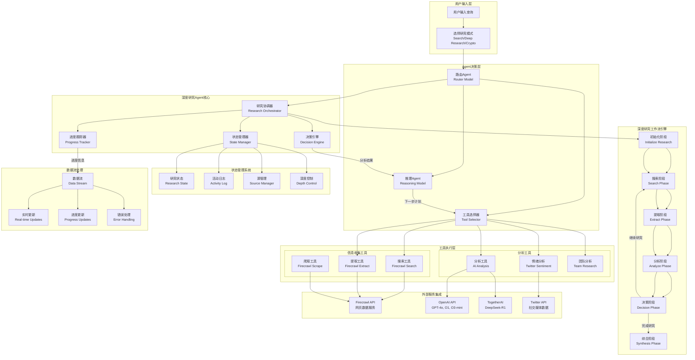
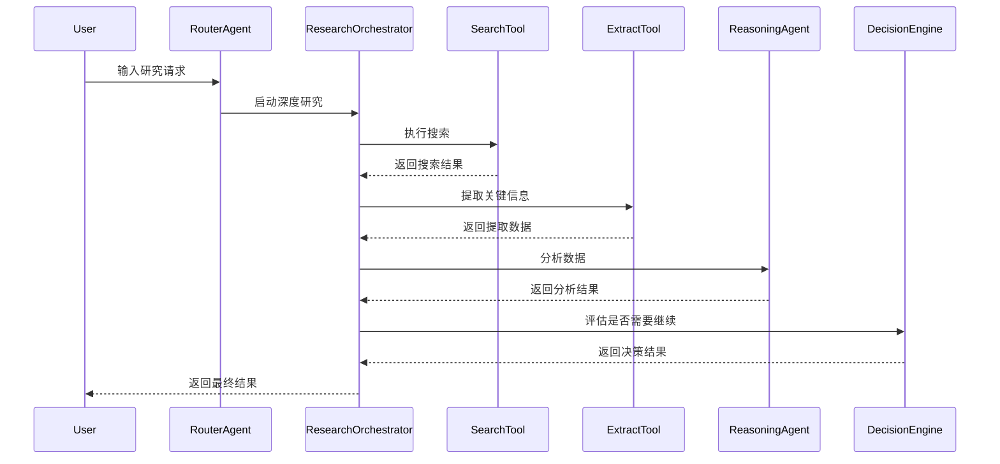
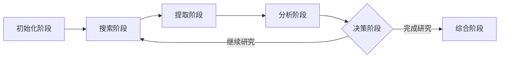
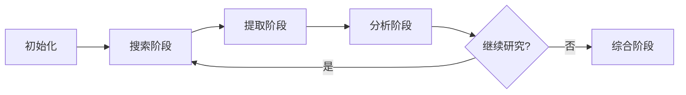

# Open Deep Research Agent 框架文档

## 📋 概述

Open Deep Research 是一个基于AI的深度研究平台，采用多Agent协作架构，能够进行多轮迭代的深度研究。该框架结合了多种AI模型、工具和服务，为用户提供专业的研究分析能力。

## 🏗️ 架构设计

### 核心设计原则

1. **模块化设计**: 每个组件职责单一，便于维护和扩展
2. **多模型支持**: 支持OpenAI、TogetherAI、OpenRouter等多个模型提供商
3. **工具生态**: 丰富的工具集，支持不同领域的研究需求
4. **状态管理**: 完整的研究状态跟踪和进度管理
5. **实时反馈**: 用户可实时查看研究进度和中间结果

## 🎯 研究模式

### 1. 基础搜索模式 (Search Mode)
- **用途**: 快速信息检索
- **工具**: Firecrawl Search
- **特点**: 单次搜索，快速响应
- **适用场景**: 简单查询、事实确认

### 2. 深度研究模式 (Deep Research Mode)
- **用途**: 多轮迭代的深度研究
- **工具**: Search + Extract + Analysis + Synthesis
- **特点**: 最多7层深度，智能决策
- **适用场景**: 复杂主题研究、综合分析

### 3. 币圈分析模式 (Crypto Research Mode)
- **用途**: 加密货币项目专业分析
- **工具**: 项目分析 + 推特情绪 + 团队调研
- **特点**: 多维度分析，专业报告
- **适用场景**: 投资决策、项目评估

## 🤖 Agent 工作原理

### Agent框架架构图



### Agent分层架构

#### 1. 用户输入层
- 用户输入查询和选择研究模式
- 支持三种模式：基础搜索、深度研究、币圈分析

#### 2. Agent决策层
- **路由Agent**: 分析用户意图，决定使用哪种研究模式
- **推理Agent**: 负责复杂的分析和决策任务
- **工具选择器**: 根据任务需求选择合适的工具

#### 3. 深度研究Agent核心
- **研究协调器**: 协调整个研究过程
- **状态管理器**: 管理研究状态和进度
- **进度跟踪器**: 实时跟踪研究进展
- **决策引擎**: 决定是否继续研究或结束

### Agent协作机制

#### 工具调用链


#### 智能决策机制
```typescript
const shouldContinue = 
  analysis.gaps.length > 0 &&           // 还有信息缺口
  currentDepth < maxDepth &&            // 未达到最大深度
  failedAttempts < maxFailedAttempts && // 未超过失败次数
  timeElapsed < timeLimit;              // 未超过时间限制
```

#### 决策因素
- **信息完整性**: 是否还有未解答的问题
- **研究深度**: 是否达到预设的最大深度
- **时间限制**: 是否还有足够时间继续
- **失败次数**: 是否超过允许的失败次数

### 深度研究工作流引擎



#### 工作流状态机
```typescript
// 工作流状态机
while (currentDepth < maxDepth) {
  // 1. 搜索阶段
  const searchResults = await searchTool.execute(query);
  
  // 2. 提取阶段  
  const extractedData = await extractTool.execute(urls);
  
  // 3. 分析阶段
  const analysis = await reasoningAgent.analyze(findings);
  
  // 4. 决策阶段
  if (!analysis.shouldContinue) break;
  
  // 5. 更新状态
  currentDepth++;
  query = analysis.nextSearchTopic;
}
```

### 实时反馈机制

#### 数据流更新
```typescript
// 活动更新
dataStream.writeData({
  type: 'activity-delta',
  content: {
    type: 'search' | 'extract' | 'analyze',
    status: 'pending' | 'complete' | 'error',
    message: string,
    timestamp: string
  }
});

// 进度更新
dataStream.writeData({
  type: 'progress-delta',
  content: {
    completedSteps: number,
    totalSteps: number,
    currentDepth: number,
    maxDepth: number
  }
});
```

### 错误处理和恢复

#### 错误处理策略
- **重试机制**: 失败后自动重试（最多3次）
- **降级处理**: 工具失败时使用备用方案
- **错误记录**: 详细记录错误信息用于调试
- **用户通知**: 向用户显示友好的错误信息

## 🤖 Agent 核心组件

### 路由模型 (Router Model)
```typescript
// 负责决定使用哪些工具和模型
const routerModel = customModel(model.apiIdentifier, false);
```

**职责**:
- 分析用户意图
- 选择合适的工具组合
- 协调不同Agent的工作

### 推理模型 (Reasoning Model)
```typescript
// 专门用于分析和决策的模型
const reasoningModel = customModel(reasoningModel.apiIdentifier, true);
```

**支持的模型**:
- `o1`, `o1-mini`, `o3-mini` (OpenAI)
- `deepseek-ai/DeepSeek-R1` (TogetherAI)
- `gpt-4o` (OpenAI)

**职责**:
- 分析研究结果
- 制定下一步研究计划
- 生成结构化输出

### 状态管理器 (State Manager)
```typescript
interface DeepResearchState {
  isActive: boolean;
  activity: ActivityItem[];
  sources: SourceItem[];
  currentDepth: number;
  maxDepth: number;
  completedSteps: number;
  totalExpectedSteps: number;
}
```

**功能**:
- 跟踪研究进度
- 管理活动日志
- 维护源信息
- 控制研究深度

## 🛠️ 工具生态系统

### Firecrawl 工具集

#### 搜索工具 (Search Tool)
```typescript
search: {
  description: "Search for web pages",
  parameters: z.object({
    query: z.string().describe('Search query'),
    maxResults: z.number().optional().describe('Max results')
  })
}
```

#### 提取工具 (Extract Tool)
```typescript
extract: {
  description: "Extract structured data from web pages",
  parameters: z.object({
    urls: z.array(z.string()).describe('URLs to extract from'),
    prompt: z.string().describe('Extraction prompt')
  })
}
```

#### 爬取工具 (Scrape Tool)
```typescript
scrape: {
  description: "Scrape web pages",
  parameters: z.object({
    url: z.string().describe('URL to scrape')
  })
}
```

### 币圈专用工具

#### 项目分析工具 (analyzeCryptoProject)
- **功能**: 综合分析加密货币项目
- **分析维度**: 团队、投资人、路线图、市场情绪
- **输出**: 结构化分析报告

#### 推特情绪分析 (getTwitterSentiment)
- **功能**: 分析社交媒体情绪
- **指标**: 提及次数、情绪评分、热门话题
- **时间范围**: 24h、7d、30d

#### 团队分析 (getProjectTeam)
- **功能**: 调研项目团队背景
- **数据源**: LinkedIn、Crunchbase
- **信息**: 履历、经验、背景

## 🔄 深度研究工作流

### 工作流阶段



### 详细流程

#### 1. 初始化阶段
```typescript
const researchState = {
  findings: [] as Array<{ text: string; source: string }>,
  summaries: [] as Array<string>,
  nextSearchTopic: '',
  urlToSearch: '',
  currentDepth: 0,
  failedAttempts: 0,
  maxFailedAttempts: 3,
  completedSteps: 0,
  totalExpectedSteps: maxDepth * 5,
};
```

#### 2. 搜索阶段
- 执行网络搜索
- 收集相关URL
- 记录搜索活动
- 更新进度状态

#### 3. 提取阶段
- 从搜索结果中提取关键信息
- 结构化数据提取
- 源信息管理
- 质量评估

#### 4. 分析阶段
```typescript
const analysis = await analyzeAndPlan(researchState.findings);
// 分析结果包含:
// - summary: 当前发现总结
// - gaps: 信息缺口
// - nextSteps: 下一步计划
// - shouldContinue: 是否继续
// - nextSearchTopic: 下一个搜索主题
```

#### 5. 决策循环
- 评估信息完整性
- 决定是否需要继续研究
- 最多支持7层深度
- 智能停止条件

#### 6. 综合阶段
- 整合所有发现
- 生成最终分析报告
- 包含详细思考和结论
- 提供源引用

## 📊 数据流管理

### 实时数据流
```typescript
// 活动更新
dataStream.writeData({
  type: 'activity-delta',
  content: {
    type: 'search' | 'extract' | 'analyze' | 'reasoning' | 'synthesis' | 'thought',
    status: 'pending' | 'complete' | 'error',
    message: string,
    timestamp: string,
    depth: number
  }
});

// 源信息更新
dataStream.writeData({
  type: 'source-delta',
  content: {
    url: string,
    title: string,
    description: string
  }
});

// 进度更新
dataStream.writeData({
  type: 'depth-delta',
  content: {
    current: number,
    max: number,
    completedSteps: number,
    totalSteps: number
  }
});
```

### 状态同步
- 前端实时显示研究进度
- 活动日志实时更新
- 源信息动态添加
- 错误处理和重试机制

## 🔧 配置和扩展

### 环境变量配置
```bash
# 模型配置
REASONING_MODEL=o1-mini
BYPASS_JSON_VALIDATION=false

# API密钥
OPENAI_API_KEY=your_key
OPENROUTER_API_KEY=your_key
TOGETHER_API_KEY=your_key
FIRECRAWL_API_KEY=your_key

# 功能开关
ENABLE_FIRECRAWL_SEARCH=true
ENABLE_FIRECRAWL_EXTRACT=true
ENABLE_FIRECRAWL_SCRAPE=true

# 性能配置
MAX_DURATION=300
```

### 工具扩展
```typescript
// 添加新工具
const newTool = {
  description: "Tool description",
  parameters: z.object({
    // 参数定义
  }),
  execute: async (params) => {
    // 工具逻辑
    return { success: true, data: result };
  }
};
```

### 模型扩展
```typescript
// 添加新模型支持
const customModel = (apiIdentifier: string, forReasoning: boolean = false) => {
  // 模型选择逻辑
  const model = newModelProvider(apiIdentifier);
  return wrapLanguageModel({ model, middleware: customMiddleware });
};
```

## 📈 性能优化

### 并发处理
- 并行执行多个提取任务
- 异步处理搜索请求
- 批量更新数据流

### 缓存策略
- Redis缓存频繁查询结果
- 本地缓存模型响应
- 智能缓存失效机制

### 错误处理
- 重试机制（最多3次）
- 优雅降级
- 详细错误日志
- 用户友好的错误提示

## 🔒 安全考虑

### 数据安全
- 用户会话管理
- API密钥保护
- 数据加密传输
- 访问控制

### 速率限制
```typescript
const { success, limit, reset, remaining } = 
  await rateLimiter.limit(identifier);
```

### 输入验证
- 参数类型检查
- URL安全验证
- 内容过滤
- 恶意输入检测

## 🚀 部署和监控

### 部署架构
- Next.js App Router
- Vercel部署
- PostgreSQL数据库
- Redis缓存
- Vercel Blob存储

### 监控指标
- 研究完成率
- 平均研究深度
- 工具使用频率
- 错误率统计
- 用户满意度

### 日志系统
- 结构化日志
- 错误追踪
- 性能监控
- 用户行为分析

## 🔮 未来规划

### 功能增强
- [ ] 更多专业领域工具
- [ ] 可视化分析结果
- [ ] 协作研究功能
- [ ] 研究模板系统

### 技术优化
- [ ] 模型微调
- [ ] 工具链优化
- [ ] 性能提升
- [ ] 成本优化

### 生态扩展
- [ ] 第三方工具集成
- [ ] API开放平台
- [ ] 插件系统
- [ ] 社区贡献

## 🎯 Agent框架核心优势

### 1. 智能协调能力
- **多Agent协作**: 不同Agent各司其职，协同工作
- **动态工具选择**: 根据任务需求智能选择最合适的工具
- **自适应决策**: 根据研究进展动态调整策略

### 2. 深度研究能力
- **多轮迭代**: 支持最多7层深度的迭代研究
- **智能停止**: 基于信息完整性和时间限制的智能决策
- **实时反馈**: 用户可实时查看研究进度和中间结果

### 3. 模块化设计
- **工具生态**: 丰富的工具集，支持不同领域研究
- **模型支持**: 支持多个AI模型提供商
- **易于扩展**: 新工具和模型可轻松集成

### 4. 专业领域支持
- **通用研究**: 支持各种主题的深度研究
- **币圈分析**: 专门的加密货币项目分析能力
- **多维度分析**: 团队、投资人、市场情绪等多角度分析

### 5. 可靠性保障
- **错误处理**: 完善的错误处理和恢复机制
- **状态管理**: 完整的研究状态跟踪
- **性能优化**: 并发处理和缓存策略

---

## 📚 相关文档

- [README.md](./README.md) - 项目概述和快速开始
- [CRYPTO_RESEARCH_FEATURES.md](./CRYPTO_RESEARCH_FEATURES.md) - 币圈分析功能说明
- [API文档](./docs/api.md) - API接口文档
- [部署指南](./docs/deployment.md) - 部署和配置指南

---

**版本**: v1.0.0  
**最后更新**: 2024年12月  
**维护者**: Open Deep Research Team
