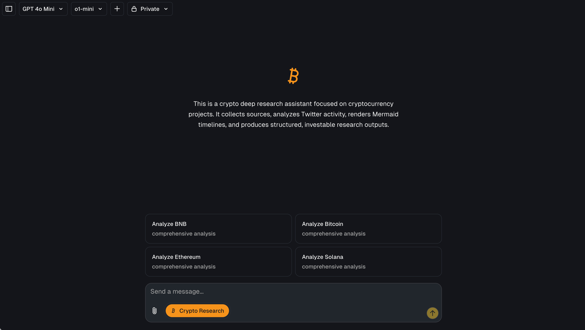

# Crypto Deep Research Platform

An intelligent deep research platform focused on cryptocurrency projects, helping investors and researchers comprehensively understand the fundamentals, technical characteristics, market dynamics, and community sentiment of various cryptocurrencies.



## Overview

This platform leverages advanced AI reasoning models combined with real-time web data extraction to provide professional cryptocurrency project analysis reports. The system automatically collects information from multiple sources including official websites, technical documentation, social media activities, and market data, then generates structured investment research reports.

## Core Features

### 📊 Comprehensive Project Analysis

- **Project Overview**: Team background, technical architecture, core value proposition
- **Investor Background**: Major investment institutions, funding history, token distribution
- **Technical Assessment**: Underlying technology, consensus mechanism, performance metrics
- **Product Ecosystem**: DeFi, NFT, DApp and other ecosystem applications

### 🔍 Multi-Dimensional Data Collection

- **Information Source Integration**: Automatically crawls and verifies information from multiple authoritative channels
  - Official documentation and whitepapers
  - Wikipedia and technical encyclopedias
  - Content platforms like Medium and YouTube
  - Data platforms like CoinGecko and CoinMarketCap
- **Real-time Data Updates**: Powered by [Firecrawl](https://firecrawl.dev) intelligent crawling technology
- **Structured Extraction**: Automatically identifies and extracts key information points

### 📈 Social Media Sentiment Analysis

- **Twitter Activity Monitoring**: Tracks official project accounts and community discussion heat
- **Sentiment Scoring**: Analyzes positive, negative, and neutral community sentiment towards projects
- **Key Event Tracking**: Identifies important announcements, partnerships, and market events
- **Influence Analysis**: Evaluates community engagement and mention frequency

### 🗺️ Visual Roadmap

- **Mermaid Timeline**: Intuitively displays project development history and future plans
- **Milestone Tracking**: Completed and upcoming important milestones
- **Technical Upgrades**: Network upgrades, new feature releases, and other key dates

### 📝 Structured Research Reports

System-generated reports include:

1. Project Summary
2. Team and Investor Background
3. Technical Architecture Analysis
4. Products and Ecosystem
5. Market Performance and Price Trends
6. Community Sentiment and Discussion Topics
7. Strengths and Risk Assessment
8. Information Source List


## Technology Stack

### Frontend Framework

- **[Next.js](https://nextjs.org)**: Modern web application built with App Router
- **[shadcn/ui](https://ui.shadcn.com)**: Beautiful UI component library
- **[Tailwind CSS](https://tailwindcss.com)**: Flexible styling system
- **[Radix UI](https://radix-ui.com)**: Accessible component primitives

### AI Capabilities

- **[Vercel AI SDK](https://sdk.vercel.ai/docs)**: Unified API for AI model invocation
- **Reasoning Model Support**:
  - OpenAI (GPT-4o, o1, o3-mini)
  - TogetherAI (DeepSeek-R1)
  - Anthropic, Cohere, and more
- **Structured Output**: Automatically generates JSON-formatted analysis results

### Data Services

- **[Firecrawl](https://firecrawl.dev)**: Intelligent web search and data extraction
- **[Vercel Postgres](https://vercel.com/storage/postgres)**: Stores chat history and user data
- **[Vercel Blob](https://vercel.com/storage/blob)**: File storage service
- **[NextAuth.js](https://github.com/nextauthjs/next-auth)**: User authentication system

## Supported Cryptocurrencies

The platform currently supports in-depth analysis of the following major cryptocurrencies:

- **Bitcoin (BTC)**: Bitcoin fundamentals and market analysis
- **Ethereum (ETH)**: Ethereum ecosystem and technical upgrade tracking
- **BNB**: Binance Smart Chain project analysis
- **Solana (SOL)**: High-performance blockchain evaluation
- **More Coins**: Supports custom analysis of any cryptocurrency project

## Getting Started

### Requirements

- Node.js 18+
- pnpm package manager
- Database (PostgreSQL)

### Running Locally

1. **Clone the repository**

```bash
git clone <your-repo-url>
cd odr
```

2. **Install dependencies**

```bash
pnpm install
```

3. **Configure environment variables**

Copy `.env.example` to `.env` and fill in the required API keys:

```bash
# AI Model Configuration
OPENAI_API_KEY=your_openai_key
REASONING_MODEL=gpt-4o               
deepseek-ai/DeepSeek-R1

# Data Scraping Service
FIRECRAWL_API_KEY=your_firecrawl_key

# Database and Storage
POSTGRES_URL=your_postgres_connection_string
BLOB_READ_WRITE_TOKEN=your_blob_token

# Authentication
AUTH_SECRET=your_auth_secret

# Optional Configuration
BYPASS_JSON_VALIDATION=false  # Set to true when using non-OpenAI models
MAX_DURATION=300              # Function timeout (seconds)
```

4. **Run database migrations**

```bash
pnpm db:migrate
```

5. **Start the development server**

```bash
pnpm dev
```

Visit [http://localhost:3000](http://localhost:3000) to start using the platform.

### Deploy with One Click

[](https://vercel.com/new/clone?repository-url=https%3A%2F%2Fgithub.com%2Fyour-username%2Fodr&env=AUTH_SECRET,OPENAI_API_KEY,FIRECRAWL_API_KEY,BLOB_READ_WRITE_TOKEN,POSTGRES_URL,REASONING_MODEL,MAX_DURATION&stores=[{%22type%22:%22postgres%22},{%22type%22:%22blob%22}])

## Model Configuration

### AI Model Providers

The platform uses OpenAI's `gpt-4o` model by default, while supporting multiple other AI providers:

- **[OpenAI](https://openai.com)**: GPT-4o, o1, o3-mini (native JSON Schema support)
- **[OpenRouter](https://openrouter.ai/)**: Access to various open-source and closed-source models
- **[TogetherAI](https://together.ai)**: DeepSeek-R1 and other open-source reasoning models
- **[Anthropic](https://anthropic.com)**: Claude series models
- **More Providers**: Supported via [AI SDK](https://sdk.vercel.ai/providers/ai-sdk-providers)

### Reasoning Model Selection

The reasoning model is used to generate structured research reports and can be configured via the `REASONING_MODEL` environment variable.

**Recommended Configuration:**

| Provider   | Model                       | Features                      | Configuration Requirements               |
| ---------- | --------------------------- | ----------------------------- | ---------------------------------------- |
| OpenAI     | `gpt-4o`                  | Fast, JSON Schema support     | Default configuration                    |
| OpenAI     | `o1`, `o3-mini`         | Strong reasoning capabilities | Default configuration                    |
| TogetherAI | `deepseek-ai/DeepSeek-R1` | Open-source, low cost         | Requires `BYPASS_JSON_VALIDATION=true` |

**Important Notes:**

- Non-OpenAI models require disabling JSON Schema validation
- The reasoning model affects report quality and structure
- Ensure the API key for your chosen model is properly configured

### Function Timeout Configuration

The default function timeout is 300 seconds (5 minutes), suitable for deep research tasks. If using Vercel's free tier, adjust to 60 seconds:

```bash
MAX_DURATION=60
```

Learn more about [Vercel function duration limits](https://vercel.com/docs/functions/configuring-functions/duration#duration-limits)

## Usage Guide

### Getting Started with Analysis

1. **Select Preset Coins**: Click quick analysis buttons on the homepage (BTC, ETH, BNB, SOL)
2. **Custom Query**: Enter any cryptocurrency project name in the input field
3. **Wait for Generation**: AI automatically collects information and generates a complete report (approximately 2-5 minutes)
4. **View Results**: Browse structured reports including charts, timelines, and information sources

### Report Content Overview

Generated research reports include the following modules:

#### 1. Price Chart

- Real-time price data and price changes
- Historical price trend visualization

#### 2. Project Overview

- Project introduction and core value
- Technical features and innovations
- Use cases and applications

#### 3. Team and Investors

- Founding team background and experience
- Core developer information
- Investment institution list
- Funding history

#### 4. Technical Analysis

- Underlying architecture and consensus mechanism
- Performance metrics (TPS, block time, etc.)
- Technical advantages and challenges

#### 5. Roadmap Timeline

- Mermaid chart displaying development history
- Important milestone annotations
- Future planning preview

#### 6. Community Sentiment

- Twitter activity analysis
- Positive/negative/neutral sentiment distribution
- Community discussion hot topics

#### 7. Information Sources

- All referenced web links
- Official documentation and whitepapers
- Third-party analysis articles
- Video resources

### Best Practices

- **Comparative Analysis**: Analyze multiple similar projects simultaneously for horizontal comparison
- **Regular Updates**: Crypto markets change rapidly, recommend regenerating reports regularly
- **Cross-Validation**: Conduct in-depth research using information source links in the report
- **Risk Warning**: Reports are for reference only, investment decisions should consider personal risk tolerance

## Technical Highlights

### 🚀 High Performance

- Concurrent data scraping for fast report generation
- Caching mechanism to reduce redundant requests
- Optimized database queries

### 🔒 Security

- NextAuth.js authentication protection
- Secure API key storage
- Encrypted user data

### 📱 Responsive Design

- Adapts to desktop, tablet, and mobile
- Modern UI/UX design
- Smooth interactive experience

### 🔄 Real-time Updates

- Automatically fetches latest information
- Real-time price data synchronization
- Social media activity tracking

## FAQ

**Q: Which cryptocurrencies are supported?**
A: All major and niche cryptocurrency projects are supported. Simply enter the project name for analysis.

**Q: How long does report generation take?**
A: Typically 2-5 minutes, depending on network speed and the number of information sources.

**Q: Are the data sources reliable?**
A: The system collects information from multiple authoritative channels including official websites, Wikipedia, technical blogs, etc., and lists all sources at the end of the report for verification.

**Q: Can I save historical reports?**
A: Yes, all generated reports are saved in your account and can be viewed anytime in your history.

**Q: How do I choose the right AI model?**
A: OpenAI's `gpt-4o` or `o1` provide the best results. If cost-sensitive, choose `deepseek-ai/DeepSeek-R1`.

## Contributing

We welcome Issues and Pull Requests!

1. Fork this repository
2. Create a feature branch (`git checkout -b feature/AmazingFeature`)
3. Commit your changes (`git commit -m 'Add some AmazingFeature'`)
4. Push to the branch (`git push origin feature/AmazingFeature`)
5. Open a Pull Request

## License

This project is licensed under the MIT License - see the LICENSE file for details

## Contact

For questions or suggestions, please contact us via:

- Submit a GitHub Issue
- Email the project maintainers

---

**Disclaimer**: The analysis reports provided by this platform are for reference only and do not constitute investment advice. Cryptocurrency investment carries high risk. Please invest carefully.
